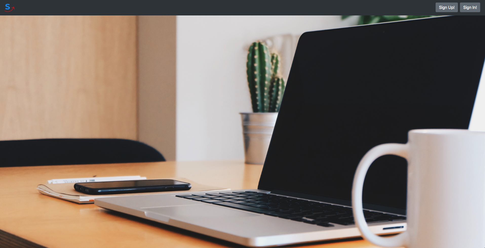
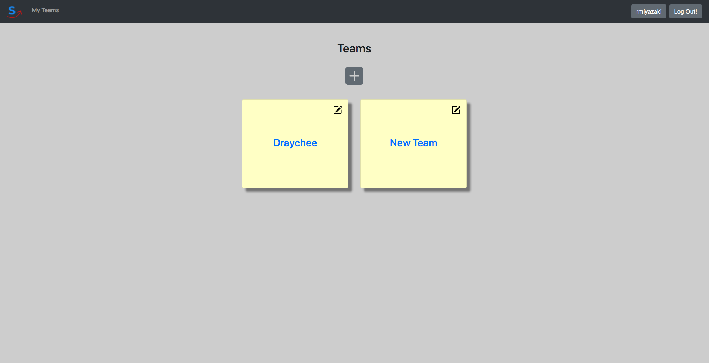
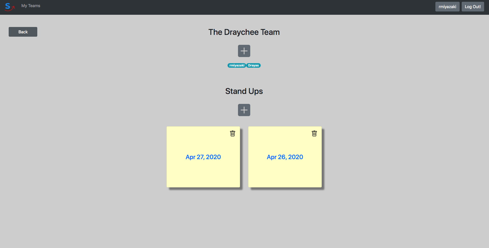
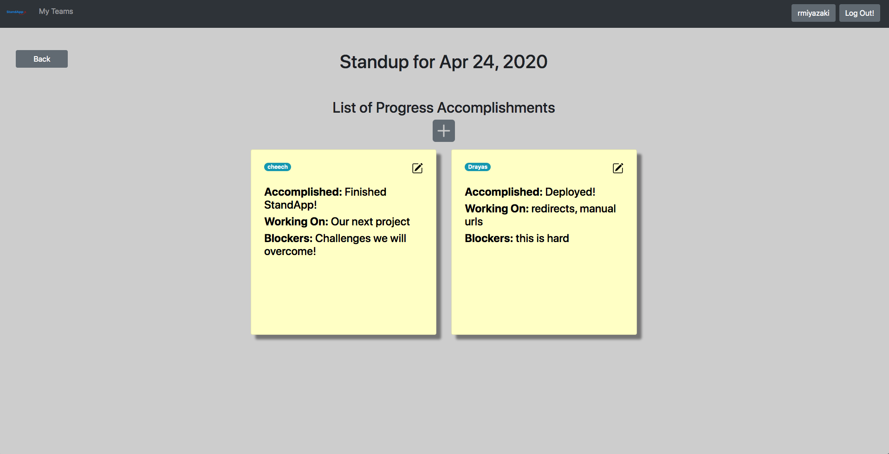

# StandApp

An App to help guide Scrums for personal use.

This repository was built with the Angular front-end framework and Django back-end.

## Table of Contents

- [Requirements](#requirements)
- [Setting up the project](#setting-up-the-project)
- [Setting up the project with Docker](#setting-up-the-project-with-docker)
- [Cleaning up the Container and Image](#cleaning-up-the-container-and-image)
- [Views](#views)
- [Features](#features)
- [Authors](#authors)

## Requirements

-Typescript 3.5+
-Angular 8.2+

- Python 3.6+
- Django 2.2+

## Setting up the project

  Start by cloning the project with the command:
  ```
  $ git clone https://github.com/rmiyazaki6499/standapp.git
  ```
  
  ## Setting up the project with Docker

  For those that are not interested in setting up the project manually or would simply not have to worry about downloading node.js and its dependencies, I have created a Dockerfile and docker-compose.yml file to help create a container with everything you would need to run the **standapp project**.

  ### Install Docker

  To make this as easy as possible, we will be using *Docker Compose* to creat our container.

  - If you do not have Docker yet, start by downloading it here if you are on a Mac or Windows:
  https://www.docker.com/products/docker-desktop

  - Or if you are on a Linux Distribution follow the directions here:
  https://docs.docker.com/compose/install/

  - To confirm you have Docker Compose, open up your terminal and run the command below:

  ```
  $ docker-compose --version
  docker-compose version 1.26.2, build eefe0d31
  ```
  
  - Go into the project directory to build and run the container with:

  ```
  $ cd standapp/
  $ docker-compose up -d --build
  ```

  **This may take a few moments, especially for the Angular Server to spin up**
  
  Navigate to http://localhost:4200 to view the Angular Frontend on the local server.
It should look something like this:



Navigate to http://localhost/8000 to view the Django REST Framework API on the local server.
  
  ### Cleaning up the Container and Image

  - To stop the container from running, use `<Ctrl-C>` twice.
  - To close down the container use the command:

  ```
  $ docker-compose down
  ```
  - Then to clean up the container and image which we are no longer using use the command:

  ```
  $ docker system prune -fa
  ```

  - Confirm that the container and image is no longer there with:

  ```
  $ docker system df -v
  ```

## Views

### Landing


### Team View




### Standup View




### Progress View




## Authors

Created by:

- [Andreas Lorentson](https://github.com/alorents)
- [Ryuichi Miyazaki](https://github.com/rmiyazaki6499)
